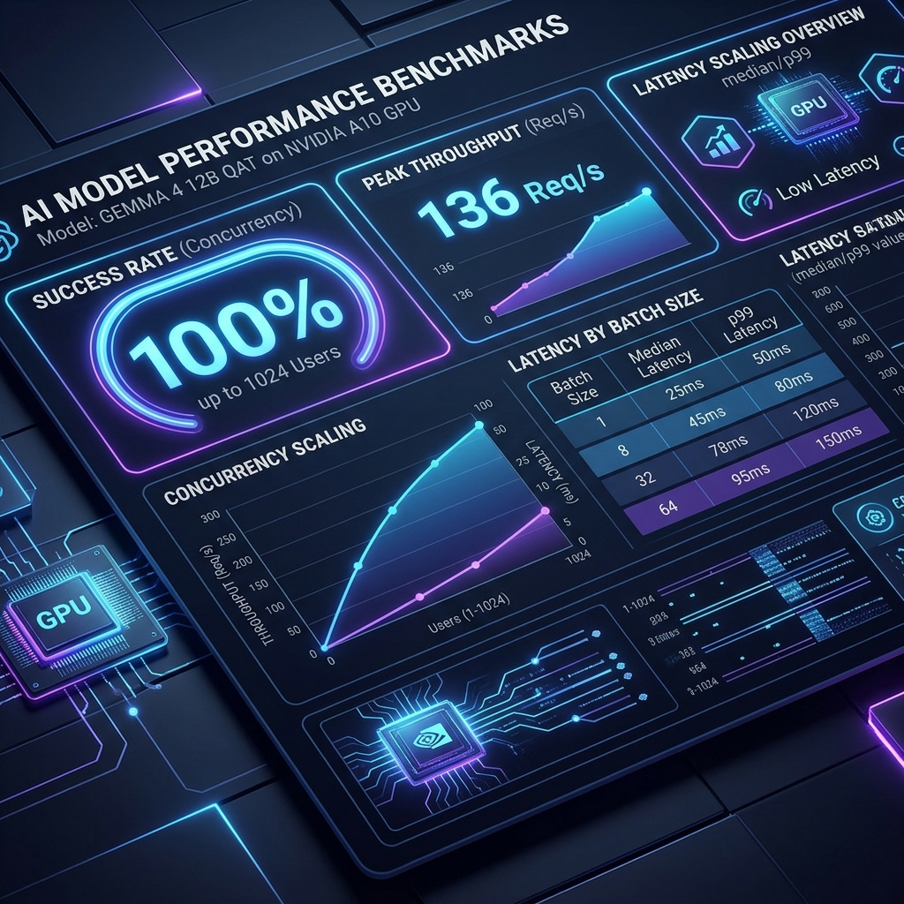

# 📊 Gemma 4 QAT GPU Benchmark Dashboard

This dashboard presents the performance characteristics of **Gemma 4 12B QAT** served via **vLLM** on a single **Azure VM (`Standard_NV36ads_A10_v5`)** hosting a virtualized **NVIDIA A10-24Q GPU (24GB VRAM)**.

---

## 📈 Performance Infographic

---

## 🕒 Performance Metrics Overview

### 1. Latency & Concurrency Scaling
- **Stability**: Maintains **100% request success rate up to 1024 concurrent users** across all tested context windows (4 to 16,384 tokens).
- **Peak Throughput**: Reached **136.0 Requests/second** under concurrent load (concurrency 64 at context size 4).
- **Stress Endurance**: Under maximum load of **2048 concurrent users**, the success rate resolved to **62.0%** for the largest 16K context size, while remaining at **100%** for smaller prompt sizes (up to 256 tokens).

### 2. Prefill Latency Matrix (seconds)
| Context (Tokens) \ Users | 1 | 8 | 64 | 512 | 1024 | 2048 |
|---:|---:|---:|---:|---:|---:|---:|
| **4** | 0.08s | 0.12s | 0.31s | 2.37s | 6.68s | 13.35s |
| **128** | 0.09s | 0.27s | 1.06s | 7.43s | 14.74s | 28.35s |
| **1024** | 0.30s | 0.32s | 1.19s | 8.33s | 16.88s | 31.44s |
| **16384** | 5.52s | 0.69s | 2.91s | 13.57s | 26.27s | 33.47s |

---

## 💡 Key SRE & DevOps Takeaways
* **VRAM Efficiency**: The **INT4 quantized weights** from QAT allow the model to run comfortably on a single NVIDIA A10 GPU, leaving ample headroom (~18 GB) for KV cache allocation, which guarantees the high concurrency levels observed.
* **Stable Scale**: Scalability on this stack shows high endurance, making it highly suitable for concurrent log analysis and high-throughput diagnostic agents in enterprise SRE environments.
