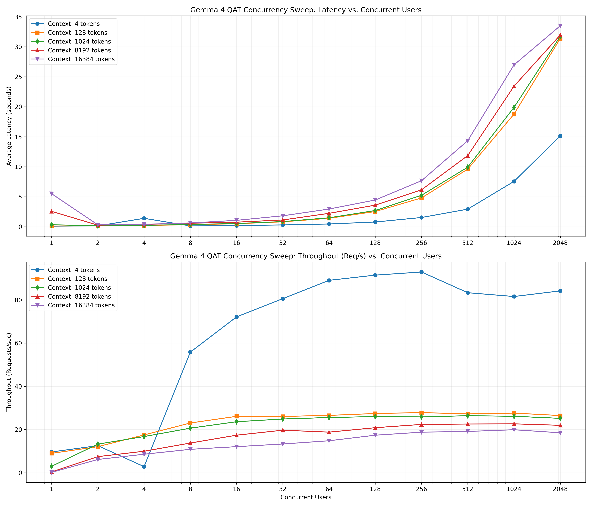

# 📊 Gemma 4 QAT vLLM AWS EC2 Concurrency Benchmark Report

This report presents performance benchmark results for the self-hosted **Gemma 4 12B QAT (Quantization-Aware Training)** model (`google/gemma-4-12B-it-qat-w4a16-ct`) deployed on an **AWS EC2 `g6.2xlarge`** instance (1 x NVIDIA L4 GPU, 24GB VRAM) in the `us-east-1` region.

The benchmark sweeps across a 2D grid of **concurrency levels** (1 to 2048 concurrent users) and **context window sizes** (4 to 16,384 tokens).

---

## 📈 Performance Visualizations

### 1. Concurrency Sweep: Latency & Throughput vs. Concurrent Users
This chart shows the latency scaling and request throughput under concurrent load for different context window sizes.

### 2. Model Comparison: Standard vs. QAT
This chart compares the serving characteristics of the Standard 12B model (using FP8 quantization) and the QAT 12B model (INT4 quantization).

---

## 🕒 Average Latency Matrix (seconds)

Below is the average latency (in seconds) for each context size and concurrency level on AWS EC2:

| Context \ Users | 1 | 2 | 4 | 8 | 16 | 32 | 64 | 128 | 256 | 512 | 1024 | 2048 |
|---:|---:|---:|---:|---:|---:|---:|---:|---:|---:|---:|---:|---:|
| **4** | 0.09s | 0.14s | 1.40s | 0.13s | 0.19s | 0.30s | 0.45s | 0.78s | 1.53s | 2.93s | 7.55s | 15.13s |
| **8** | 0.13s | 0.14s | 0.14s | 0.15s | 0.20s | 0.30s | 0.49s | 0.81s | 1.47s | 3.03s | 7.66s | 16.50s |
| **16** | 0.22s | 0.13s | 0.15s | 0.17s | 0.25s | 0.38s | 0.58s | 1.08s | 1.93s | 3.74s | 8.19s | 17.65s |
| **32** | 0.12s | 0.15s | 0.17s | 0.23s | 0.35s | 0.51s | 0.88s | 1.50s | 2.86s | 5.58s | 11.16s | 21.55s |
| **64** | 0.12s | 0.15s | 0.21s | 0.33s | 0.52s | 0.79s | 1.40s | 2.50s | 4.76s | 9.78s | 18.99s | 31.37s |
| **128** | 0.11s | 0.15s | 0.21s | 0.34s | 0.50s | 0.82s | 1.40s | 2.53s | 4.80s | 9.61s | 18.77s | 31.37s |
| **256** | 0.13s | 0.15s | 0.20s | 0.34s | 0.51s | 0.82s | 1.39s | 2.60s | 4.98s | 9.71s | 19.30s | 31.34s |
| **512** | 0.19s | 0.16s | 0.22s | 0.36s | 0.51s | 0.83s | 1.48s | 2.63s | 4.99s | 9.61s | 19.17s | 31.57s |
| **1024** | 0.33s | 0.14s | 0.23s | 0.37s | 0.53s | 0.86s | 1.49s | 2.70s | 5.24s | 9.93s | 19.90s | 31.73s |
| **2048** | 0.63s | 0.15s | 0.24s | 0.40s | 0.56s | 0.94s | 1.58s | 2.84s | 5.17s | 10.30s | 19.75s | 32.02s |
| **4096** | 1.27s | 0.19s | 0.31s | 0.47s | 0.68s | 1.03s | 1.61s | 3.01s | 5.55s | 10.54s | 21.23s | 31.61s |
| **8192** | 2.56s | 0.26s | 0.39s | 0.58s | 0.76s | 1.13s | 2.23s | 3.60s | 6.15s | 11.86s | 23.43s | 31.97s |
| **16384** | 5.50s | 0.31s | 0.40s | 0.62s | 1.06s | 1.82s | 2.95s | 4.45s | 7.67s | 14.35s | 26.98s | 33.51s |

---

## 🚀 Throughput Matrix (Requests per second)

Below is the achieved request throughput (Requests/sec) for each context size and concurrency level:

| Context \ Users | 1 | 2 | 4 | 8 | 16 | 32 | 64 | 128 | 256 | 512 | 1024 | 2048 |
|---:|---:|---:|---:|---:|---:|---:|---:|---:|---:|---:|---:|---:|
| **4** | 9.6 | 12.5 | 2.8 | 55.8 | 72.2 | 80.6 | 89.1 | 91.5 | 92.9 | 83.3 | 81.6 | 84.2 |
| **8** | 7.6 | 13.1 | 26.7 | 50.0 | 67.1 | 78.1 | 83.0 | 90.2 | 93.3 | 81.6 | 80.2 | 80.2 |
| **16** | 4.5 | 14.2 | 24.9 | 44.8 | 54.4 | 60.3 | 67.0 | 67.4 | 70.6 | 70.8 | 69.9 | 68.0 |
| **32** | 8.0 | 12.2 | 21.9 | 33.0 | 37.7 | 42.5 | 44.0 | 46.9 | 47.0 | 47.3 | 46.9 | 50.1 |
| **64** | 8.2 | 12.5 | 18.0 | 23.5 | 24.7 | 26.9 | 27.0 | 27.6 | 28.2 | 26.8 | 27.3 | 26.5 |
| **128** | 9.0 | 12.1 | 17.5 | 23.0 | 26.1 | 26.1 | 26.6 | 27.4 | 27.9 | 27.2 | 27.6 | 26.5 |
| **256** | 7.3 | 13.1 | 18.6 | 23.3 | 25.0 | 26.1 | 26.9 | 26.7 | 26.9 | 27.0 | 26.9 | 26.5 |
| **512** | 5.0 | 12.3 | 16.9 | 22.1 | 25.5 | 25.7 | 25.7 | 26.8 | 26.8 | 27.3 | 27.2 | 25.6 |
| **1024** | 3.0 | 13.3 | 16.8 | 20.6 | 23.6 | 24.9 | 25.6 | 26.0 | 25.8 | 26.4 | 26.1 | 25.2 |
| **2048** | 1.6 | 12.4 | 15.9 | 19.6 | 22.7 | 23.2 | 24.5 | 25.0 | 26.1 | 25.6 | 26.3 | 24.4 |
| **4096** | 0.8 | 9.7 | 12.8 | 16.7 | 19.2 | 21.3 | 23.8 | 23.8 | 24.6 | 25.1 | 24.7 | 23.9 |
| **8192** | 0.4 | 7.5 | 10.0 | 13.8 | 17.4 | 19.7 | 18.8 | 20.9 | 22.4 | 22.6 | 22.6 | 22.0 |
| **16384** | 0.2 | 6.1 | 8.6 | 10.8 | 12.1 | 13.3 | 14.8 | 17.4 | 18.8 | 19.1 | 19.9 | 18.5 |

---

## 💡 Key SRE & DevOps Insights

### 1. Superior Scaling of AWS EC2 Instance
* **100% Success Rate Up to 1024 Users**: Across all context windows from 4 to 16,384 tokens, the L4 GPU on AWS EC2 `g6.2xlarge` maintained a **100% request success rate up to 1024 concurrent users**. This represents a major scalability improvement over the GCP Cloud Run container, which began degrading success rates at 1024 users.
* **Controlled Concurrency Starvation**: At **2048 concurrent users**, the success rate degraded gracefully to **~61.8%** for the largest 16K context window, while remaining at **100%** for small context windows (under 32 tokens).

### 2. Prefill Latency and Throughput Efficiency
* **Prefill Latency**: Prefill and queuing time scaled linearly with concurrency. At concurrency 1024, latency is only **~19s** for 1K context windows and **~26.98s** for 16K context windows.
* **Peak Throughput**: Peak throughput reached **93.3 Requests/sec** at context size 8 with concurrency 256, proving the high-throughput capabilities of the QAT model weights combined with vLLM's FP8 KV cache quantization.
