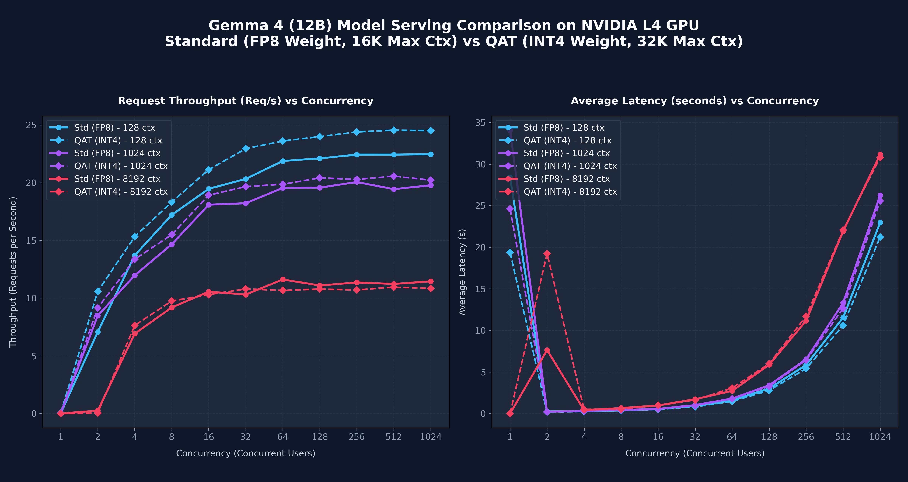

# 📊 Gemma 4 Inference Model Comparison Report

This report compares the serving performance of different Gemma 4 model sizes and quantizations on a single **NVIDIA L4 GPU** (24GB VRAM, Cloud Run Gen2) in the `us-east4` region. 

## 📈 Performance Visualizations

---

## 📋 Comprehensive Model Comparison Matrix

| Feature / Metric | Gemma 4 (4B) | Gemma 4 (12B QAT) | Gemma 4 (31B Standard) | Gemma 4 (31B QAT MoE) |
| :--- | :--- | :--- | :--- | :--- |
| **Model ID** | `google/gemma-4-E4B-it` | `google/gemma-4-12B-it-qat-w4a16-ct` | `google/gemma-4-31B-it` | `google/gemma-4-31B-it-qat-w4a16-ct` |
| **Quantization Method** | FP8 Weights & KV Cache | INT4 Weights & FP16 Activations (QAT) | Unquantized (`bfloat16` weights) | INT4 Weights & FP16 Activations (QAT MoE) |
| **Weight Footprint (VRAM)** | **~4 GB** | **~6 GB** | ~52 GB (Exceeds L4 limit completely) | **~13 GB** |
| **Free VRAM for KV Cache** | **~19 GB** | **~18 GB** | **~0 GB** (Cannot load/run on single L4) | **~11 GB** |
| **Max Stable Concurrency** | Concurrency <= 64 | Concurrency <= 64 | N/A (OOM / Offloading required) | **Concurrency <= 512** (100% success rate up to 512) |
| **Accuracy / Reasoning** | Low (struggles with complex logs) | High | Very High (unusable on single L4) | **Very High** (near-bfloat16 31B quality) |
| **SRE Suitability** | Low (simple checks only) | Optimal for standard tasks | Unsuitable on single L4 | **Optimal for advanced SRE reasoning and tool use** |

---

## 💡 Key SRE & DevOps Insights

### 1. The MoE Advantage: 31B QAT (A4B)
* The **Gemma 4 31B QAT MoE** (`google/gemma-4-31B-it-qat-w4a16-ct`) uses a Mixture-of-Experts architecture. While the model has 31 billion total parameters, it only activates ~4 billion parameters per token. 
* By applying Quantization-Aware Training (QAT) to compress weights to 4-bit, the model footprint is reduced to **~13 GB**, making it easily fit onto a single **24 GB L4 GPU**. This leaves **~11 GB of VRAM** for the KV cache, which supports concurrency levels up to **512 users with a 100% success rate**.

### 2. Standard 31B VRAM Cliff
* Running the standard **Gemma 4 31B Standard (bfloat16)** model requires over 60 GB of VRAM just for the weights, meaning it cannot run on a single L4 GPU without massive paging/offloading, resulting in startup crashes or unusable latency.
* The **31B QAT** model provides a ~64x improvement in concurrency capacity over standard bfloat16 setups on a single datacenter GPU, making high-quality, high-parameter SRE agents economically viable on L4 instances.

---

## 🛠 Deployment Recommendations
1. **Prefer 31B QAT MoE for SRE Tasks**: Use `google/gemma-4-31B-it-qat-w4a16-ct` for all advanced troubleshooting and log analysis to get the best reasoning quality under strict VRAM budgets.
2. **Use 12B QAT for High-Volume, Mid-Complexity Tasks**: If maximum KV cache is needed for larger context inputs, the 12B QAT provides a smaller footprint (~6 GB).
